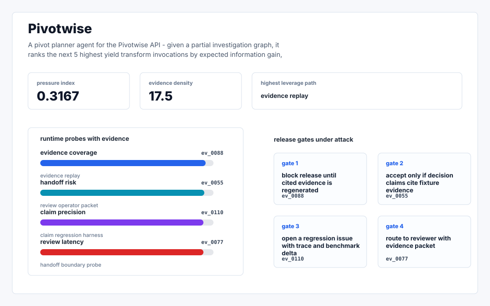
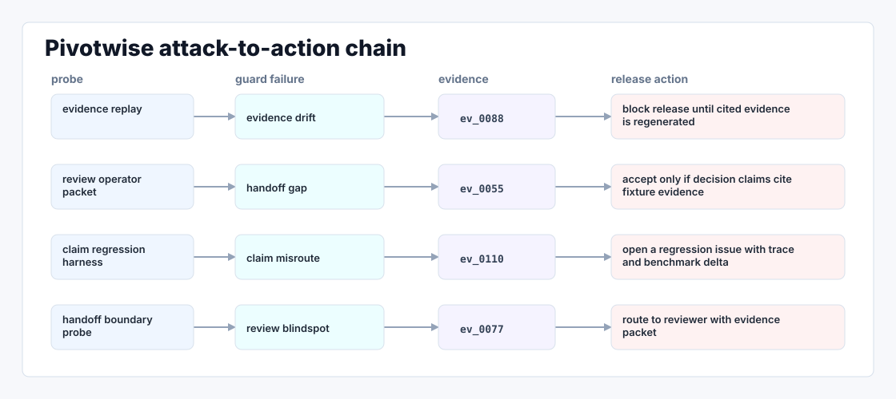

# Pivotwise

A pivot planner agent for the Pivotwise API — given a partial investigation graph, it ranks the next 5 highest yield transform invocations by expected information gain, with a Spanish/Portuguese native UI for LATAM channel partners.



## Why it exists

Pivotwise' own Crimewall page headlines "AI powered link analysis and automation." Under the marketing, the actual AI moments inside an investigation today are mostly classifier level (image recognition, sentiment, OCR) — not the agentic layer that decides which of the 1,500 methods to fire next given a partially built graph. The YouTube tutorials.

The project is intentionally built as a local replay harness instead of a slide. It creates fixtures, plants realistic failure modes, produces citation-locked evidence, and turns the result into a dashboard a reviewer can inspect without credentials or hosted services.

## What is inside

- Deterministic fixture generation for the company-specific risk surface.
- Strategy code in `src/pivotwise/strategy.py` with project-specific scoring and visual evidence.
- Citation-locked reports where every decision claim points to a generated evidence ID.
- Two regenerated visual artifacts: `outputs/project_working.svg` and `outputs/evidence_map.svg`.
- A portable demo pack with JSON, CSV, Markdown, HTML, SVG, benchmark, and test artifacts.



## Signals it measures

- `social coverage`
- `links risk`
- `crimewall precision`
- `headlines latency`

## Failure modes it plants

- social drift
- links gap
- crimewall misroute
- headlines blindspot

## Run it locally

```bash
uv sync
uv run pivotwise all
uv run pytest -q
uv run ruff check .
```

## Outputs worth opening

- `outputs/dashboard.html`
- `outputs/project_working.svg`
- `outputs/evidence_map.svg`
- `outputs/operator_brief.md`
- `outputs/decision_report.md`
- `outputs/strategy_model.json`
- `outputs/demo_pack.zip`

## Boundary

Everything runs locally against synthetic fixtures. There are no credentials, no customer records, no outreach files, and no hosted API dependency.
